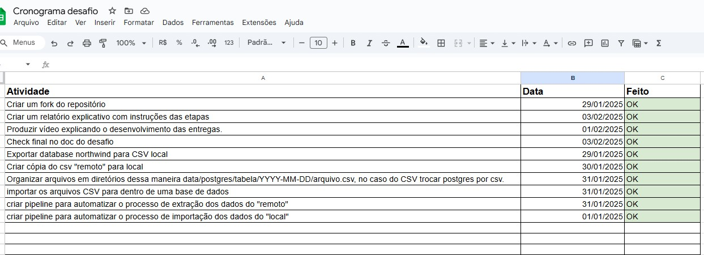

# Relatório de Entrega - Desafio Técnico Indicium Tech
  
**Candidato:** Filipe Tavares  
**Posição:** Engenheiro de Dados  
**Branch de Entrega:** LH_ED_FILIPETAVARES  
  
# Visão Geral do Projeto
  
O desafio consistiu em desenvolver uma pipeline de dados para extrair dados de duas fontes (um banco de dados PostgreSQL e um arquivo CSV), armazená-los localmente em disco e, posteriormente, carregá-los em um banco de dados PostgreSQL. A solução foi implementada utilizando as ferramentas Meltano (para extração e carregamento de dados) e Airflow (para orquestração e agendamento das tarefas).
  
O objetivo final foi consolidar os dados de pedidos (orders) e detalhes de pedidos (order_details) em um único banco de dados, permitindo a execução de uma query que relaciona essas duas tabelas.
  
# Ferramentas Utilizadas
**Sistema Operacional:** Linux  
**Banco de Dados:** PostgreSQL  
**Versionamento:** GitHub  
**Orquestração:** Apache Airflow  
**Extração e Carregamento de Dados:** Meltano  
  **Justificativa:** Optei pelo Meltano pela disponibilidade de documentação e suporte na Indicium Academy.  
  
# Estrutura do Projeto
  
O Projeto foi organizado em 6 etapas técnicas e 4 etapas de documentação no cronograma.

  
#1. - Extração e Armazenamento Local
  
**1A - Exportar database northwind para CSV local**  
  
**1B - Criar cópia do csv "remoto" para local**  
  
**1C - Organizar arquivos em diretórios dessa maneira data/postgres/tabela/YYYY-MM-DD/arquivo.csv, no caso do CSV trocar postgres por csv.**  
  
*Fonte de Dados:*  
 - Banco de dados PostgreSQL (Northwind).  
 - Arquivo CSV (order_details.csv).  
*Ferramenta:* Meltano (tap-postgres para PostgreSQL e tap-csv para o arquivo CSV).  
*Formato de Saída:* Arquivos CSV.  
*Estrutura de Diretórios:*  
 /data/postgres/{table}/YYYY-MM-DD/file.csv    
 /data/csv/YYYY-MM-DD/file.csv   
*Exemplo:*  
 /data/postgres/orders/2024-01-01/file.csv    
 /data/csv/2024-01-01/file.csv    
*Decisões Técnicas:*  
 - Utilizei CSV como formato de saída por sua simplicidade e compatibilidade com ferramentas de ETL.  
 - A estrutura de diretórios foi organizada por fonte, tabela e data para facilitar o reprocessamento de dados históricos.  
  
#2. - Carregamento para o Banco de Dados Final  
**2A - Importar os arquivos CSV para dentro de uma base de dados**  
  
**Ferramenta:** Meltano (tap-csv para leitura dos arquivos locais e target-postgres para carregamento no PostgreSQL).  
  
**Decisões Técnicas:**
 - Mantive a nomenclatura das tabelas no banco de dados final igual ao nome dos arquivos CSV (com a extensão .csv incluída).  
 - Adicionei a capacidade de parametrizar a data de execução para permitir o reprocessamento de dias anteriores.  

Orquestração com Airflow
Foram criadas duas DAGs no Airflow para orquestrar o processo:

1. DAG de Extração (data_extract.py)
Descrição: Extrai dados do PostgreSQL e do arquivo CSV, salvando-os localmente em disco.

Agendamento: Executa diariamente, 15 minutos antes da DAG de carregamento.

Idempotência: Garantida pela estrutura de diretórios baseada na data.

2. DAG de Carregamento (data_loader.py)
Descrição: Carrega os dados dos arquivos CSV locais para o banco de dados PostgreSQL.

Parametrização: Permite a execução para datas específicas através da variável testedata no Airflow.

Dependências: Só é executada após a conclusão bem-sucedida da DAG de extração.
# Meltano

Na pasta ELT contém 2 projetos (para melhor organização das etapas), o de extração dos dados de uma base postgres e arquivo .CSV e de carregamento dos dados para uma base postgres.

## Extração de dados

O projeto de extração utiliza 2 plugins para extrair dados, 1 para capturar os dados da base postgres(tap-postgres) em cada tabela e exportar para um arquivo CSV através de um plugin de carregamento(target-csv).
A base de dados foi instalado um postgres local e importado o backup .sql do repositório do desafio.
O segundo plugin utiliza um extrator de arquivo .CSV (tap-csv) e utiliza o mesmo plugin para carregamento(target-csv) utilizado na extração dos dados do postgres.
O arquivo .csv foi adicionado a um diretório local (simulando um diretório externo ao projeto), copiado do repositório do desafio.
Ambos salvam arquivos .CSV com os respectivos nomes seguindo o padrão:

output/data/postgres/{table}/2024-01-01/file.csv
output/data/postgres/{table}/2024-01-02/file.csv
output/data/csv/2024-01-02/file.csv

(Ficou um gap que está salvando o nome do eschema do postgres no nome dos arquivos, mantive dessa forma pois iria extrapolar o tempo de entrega do projeto para solucionar)

## Carregamento de dados

O projeto de carregamento de dados utiliza um plugin para ler os dados dos arquivos .CSV (tap-csv) que faz o stream para carregar os dados na base postgres através do plugin (target-postgres).
Este salva as tabelas com os mesmos nomes dos arquivos.
(Ficou um gap para retirar o ".csv" do nome das tabelas, mas o tempo estava esgotando para entrega do projeto e acabei optando por manter dessa forma sem pesquisar uma solução)

# Airflow

No projeto do airflow foram criados 2 arquivos DAG para separar as pipelines de extração e carregamento, elas são agendadas com um intervalo de 15 minutos entre a de extração para de carregamento para não ter problema de execução conconrrente entre elas.

## Pipeline de extração de dados

Foi criado o arquivo data_extract.py dentro da pasta dags para configurar a pipeline de extração de dados.
A extração de dados foi configurada para executar diáriamente de forma automática e configurada para executar 15 minutos antes da pipeline de carregamento dos dados para garantir que seja finalizada a execução antes de realizar o carregamento dos dados. 

## Pipeline de carregamento de dados

Foi criado o arquivo data_loader.py dentro da pasta dags para configurar a pipeline de carregamento de dados.
Foi adicionado a possibilidade de parametrizar a data de carregamento através das variáveis personalizadas do airflow "testedata" com a data desejada para execução no formato (YYYY-MM-DD).
Esta variável pode ser criada diretamente na interface do airflow, no meu admin>variáveis, basta criar uma variável com a chave "testedata" e valor com a data, caso não tenha data preenchida na variável será utilizado a data do dia da execução para carregar os dados para o postgres (não pode esquecer de manter a variável vazia para execução diária de forma natural).

