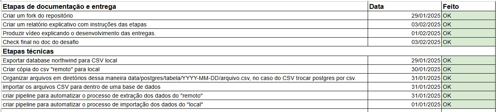
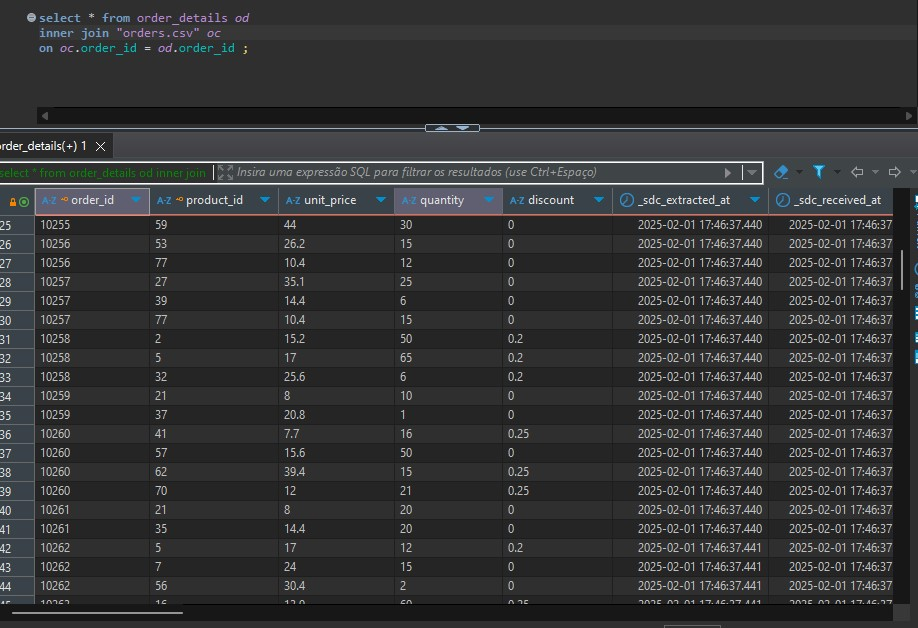

# Relatório de Entrega - Desafio Técnico Indicium Tech
  
**Candidato:** Filipe Tavares  
**Posição:** Engenheiro de Dados  
**Branch de Entrega:** LH_ED_FILIPETAVARES  
  
# Visão Geral do Projeto
  
O desafio consistiu em desenvolver uma pipeline de dados para extrair dados de duas fontes (um banco de dados PostgreSQL e um arquivo CSV), armazená-los localmente em disco e, posteriormente, carregá-los em um banco de dados PostgreSQL. A solução foi implementada utilizando as ferramentas Meltano (para extração e carregamento de dados) e Airflow (para orquestração e agendamento das tarefas).
  
O objetivo final foi consolidar os dados de pedidos (orders) e detalhes de pedidos (order_details) em um único banco de dados, permitindo a execução de uma query que relaciona essas duas tabelas.
  
# Ferramentas Utilizadas
**Sistema Operacional:** Linux  
**Banco de Dados:** PostgreSQL  
**Versionamento:** GitHub  
**Orquestração:** Apache Airflow  
**Extração e Carregamento de Dados:** Meltano  
  **Justificativa:** Optei pelo Meltano pela disponibilidade de documentação e suporte na Indicium Academy.  
  
# Estrutura do Projeto
  
O Projeto foi organizado em 6 etapas técnicas e 4 etapas de documentação no cronograma.

    
## 1. - Extração e Armazenamento Local
  
**1A - Exportar database northwind para CSV local**  
  
**1B - Criar cópia do csv "remoto" para local**  
  
**1C - Organizar arquivos em diretórios dessa maneira data/postgres/tabela/YYYY-MM-DD/arquivo.csv, no caso do CSV trocar postgres por csv.**  
  
*Fonte de Dados:*  
 - Banco de dados PostgreSQL (Northwind).  
 - Arquivo CSV (order_details.csv).  
*Ferramenta:* Meltano (tap-postgres para PostgreSQL e tap-csv para o arquivo CSV).  
*Formato de Saída:* Arquivos CSV.  
*Estrutura de Diretórios:*  
 /data/postgres/{table}/YYYY-MM-DD/file.csv    
 /data/csv/YYYY-MM-DD/file.csv   
*Exemplo:*  
 /data/postgres/orders/2024-01-01/file.csv    
 /data/csv/2024-01-01/file.csv    
*Decisões Técnicas:*  
 - Utilizei CSV como formato de saída por sua simplicidade e compatibilidade com ferramentas de ETL.  
 - A estrutura de diretórios foi organizada por fonte, tabela e data para facilitar o reprocessamento de dados históricos.  
  
## 2. - Carregamento para o Banco de Dados Final  
**2A - Importar os arquivos CSV para dentro de uma base de dados**  
  
**Ferramenta:** Meltano (tap-csv para leitura dos arquivos locais e target-postgres para carregamento no PostgreSQL).  
  
**Decisões Técnicas:**
 - Mantive a nomenclatura das tabelas no banco de dados final igual ao nome dos arquivos CSV (com o schema e a extensão .csv incluída).  
 - Adicionei a capacidade de parametrizar a data de execução para permitir o reprocessamento de dias anteriores.  

## Orquestração com Airflow  

Foram criadas duas DAGs no Airflow para orquestrar o processo:

**1. DAG de Extração (data_extract.py)**  
  
**Descrição:** Extrai dados do PostgreSQL e do arquivo CSV, salvando-os localmente em disco.  
**Agendamento:** Executa diariamente, 15 minutos antes da DAG de carregamento.  
**Idempotência:** Garantida pela estrutura de diretórios baseada na data.  

**2. DAG de Carregamento (data_loader.py)**  
  
**Descrição:** Carrega os dados dos arquivos CSV locais para o banco de dados PostgreSQL.  
**Parametrização:** Permite a execução para datas específicas através da variável testedata no Airflow.  
**Dependências:** Só é executada com sucesso após a conclusão bem-sucedida da DAG de extração.  

## Evidências de Execução

  
    
**Resultado:** O resultado da query foi salvo no arquivo [Evidencias.csv](data/evidencias.csv) como evidência da execução bem-sucedida.  
**Logs e Monitoramento:** Todos os logs de execução das DAGs estão disponíveis no Airflow, permitindo a identificação clara de falhas e a necessidade de reprocessamento.  

## Instruções para Execução  
  
**Pré-requisitos:**  
  - Instalar e configurar o PostgreSQL.  
  - Instalar o Airflow e configurar as conexões com o banco de dados.
  - Instalar o Meltano e configurar os plugins necessários (tap-postgres, tap-csv, target-postgres, target-csv).
  - Reconfigurar os diretórios e conexões de banco de dados conforme necessário 

**Executando o Projeto:**  
  
  - Clone o repositório: [code-challenge/LH_ED_FILIPETAVARES](https://github.com/FilipeTavaresR/code-challenge/tree/LH_ED_FILIPETAVARES)  
  - Execute as DAGs no Airflow:  
    A DAG de extração será executada automaticamente todos os dias.  
    A DAG de carregamento pode ser executada manualmente ou agendada.  
  
**Reprocessamento para Datas Anteriores:**
  - No Airflow, crie uma variável chamada testedata com a data desejada no formato YYYY-MM-DD.
  - Execute a DAG de carregamento para reprocessar os dados da data especificada.

## Gaps e Melhorias Futuras
  
**1 - Gaps Identificados:**  
  - O nome do schema do PostgreSQL está sendo salvo no nome dos arquivos CSV.
  - O nome das tabelas no banco de dados final inclui a extensão .csv.  
  
**2 - Melhorias Futuras:**  
  
  -  Utilizar Docker para containerizar o ambiente e facilitar a execução em diferentes sistemas.
  -  Implementar testes automatizados para garantir a qualidade do código.
  -  Adicionar tratamento de erros mais robusto para lidar com falhas durante a execução.

## Conclusão  
  
O desafio foi concluído com sucesso, atendendo a todos os requisitos propostos. A pipeline desenvolvida é escalável, idempotente e preparada para reprocessamento de dados históricos. As decisões técnicas foram tomadas com base na simplicidade, eficiência, facilidade de manutenção e considerando o prazo de entrega.    
